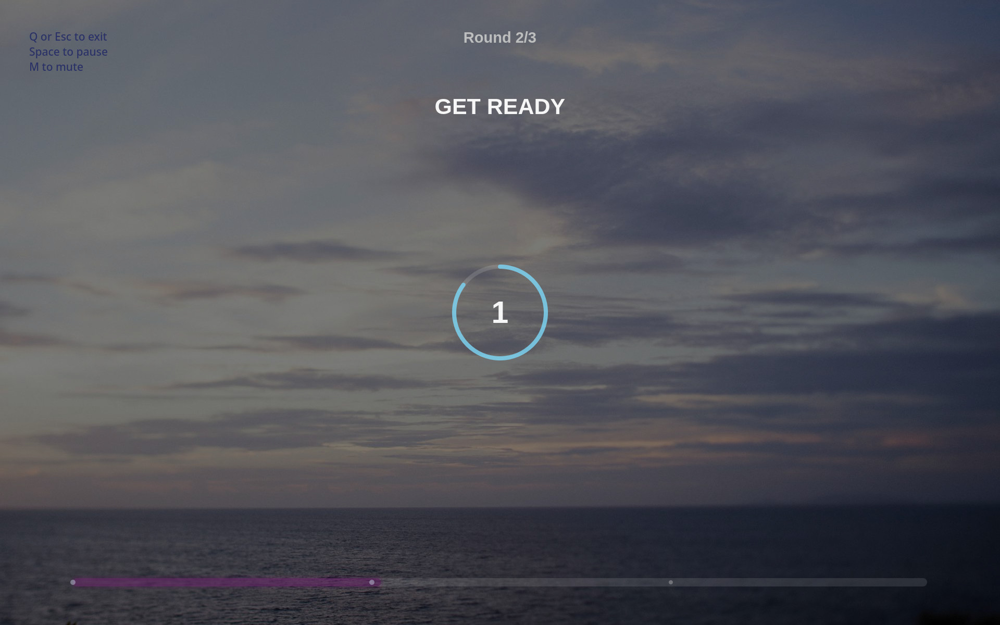

# Wim Hof Breathing Trainer

_Atmospheric desktop breathing trainer.
Inspired by the [Wim Hof breathing method](https://www.wimhofmethod.com/)._

Built with PySide6 and YAML-driven session configuration, featuring smooth animations, ambient visuals, and structured breathing rounds.

Very thanks to authors of this video: [Техника Вима Хофа | Почему она работает так хорошо?](https://www.youtube.com/watch?v=JvcbOnzZkyc).

---

## ✨ Features

- Guided Wim Hof breathing sessions
- Multi-round support (30–40+ cycles per round)
- Deep inhale + breath hold + final countdown phase
- Smooth easing breathing animation
- Glowing breathing ring visualization
- Round progress display (e.g. `Round 1/3`)
- Cycle countdown per round
- Immersive fullscreen interface
- Background image support
- Looping ambient music
- Keyboard control (ESC or Q to exit)

---

## 🌊 Design Philosophy

This project focuses on calm pacing, smooth transitions, and uninterrupted breathing flow.

The goal is not feature complexity, but creating a comfortable and immersive breathing experience.

---

## 🧠 Breathing Protocol

The default session consists of three breathing rounds.

Each round consists of:

1. Breathing cycles (inhale / exhale repeated ~30 times)
2. Breath hold (~60 seconds)
3. Deep inhale after hold (~3 seconds)
4. Breath hold (~15 seconds)
5. Relax countdown (3–5 seconds, no visual ring)

---

## 🖥️🎬 Demo



##### [demo/demo-v.0.1.0.webm](demo/demo-v.0.1.0.webm) (1.0 Mb)

## 📁 Project Structure

```text
wimhof
├── demo
│   ├── demo-v.0.1.0-preview.jpg
│   ├── demo-v.0.1.0.png
│   └── demo-v.0.1.0.webm
├── src
│   └── wimhof
│       ├── assets
│       │   ├── __init__.py
│       │   ├── app_icon.jpg
│       │   ├── background.jpg
│       │   └── music.mp3
│       ├── __init__.py
│       ├── config.yaml
│       └── main.py
├── .gitignore
├── .gitattributes
├── pyproject.toml
├── README.md
└── uv.lock

```

---

## ⚙️ Installation

Clone repository:

```bash
git clone https://github.com/yourname/wimhof.git
cd wimhof

```

Using [uv](https://docs.astral.sh/uv/):

```bash
uv sync
```

Run the application:

```bash
uv run wimhof
```

## ⚙️ Configuration

All breathing logic is defined in config.yaml.

Example:

```yaml
background_image: assets/background.jpg
background_music: assets/music.mp3

rounds:
  - name: "Round 1"
    repetitions: 30

    inhale:
      duration: 2.2
      label: "INHALE"

    exhale:
      duration: 2.2
      label: "EXHALE"

    hold:
      duration: 60.0
      label: "HOLD"

    deep_inhale:
      duration: 3.0
      label: "DEEP INHALE"

    final_hold:
      duration: 15.0
      label: "HOLD"

    relax_countdown:
      duration: 5.0
      label: "RELAX"

  - name: "Round 2"
    repetitions: 30
    inherit: true

  - name: "Round 3"
    repetitions: 30
    inherit: true
```

## 🎨 Controls

|   Key    |          Action          |
| :------: | :----------------------: |
| ESC or Q |     Exit application     |
|    M     |      Mute / Unmute       |
|  Space   | Pause / Resume / Restart |

## 🧘 Usage Notes

This application is designed for controlled breathing practice and relaxation.

⚠️ Do not use while driving, swimming, or in unsafe environments.

## 🎵 Media Sources

Background image and music are used under free licenses:

Full attribution information is available in [src/wimhofassets/sources.md](src/wimhof/assets/sources.md).

## 🧩 Dependencies

Defined in [pyproject.toml](pyproject.toml):

```toml
dependencies = [
  "pyside6>=6.11.1",
  "pyyaml>=6.0.3",
]
```

## 🚀 Roadmap (🧊 Icebox)

- Audio cues for inhale/exhale transitions
- Voice guidance (TTS coach mode)
- Session presets (Focus / Sleep / Energy)
- Statistics tracking
- Mobile version
- Haptic feedback support

## 📄 License

[MIT](LICENSE)

© May 2026 dmi3s. Built with assistance from ChatGPT.
